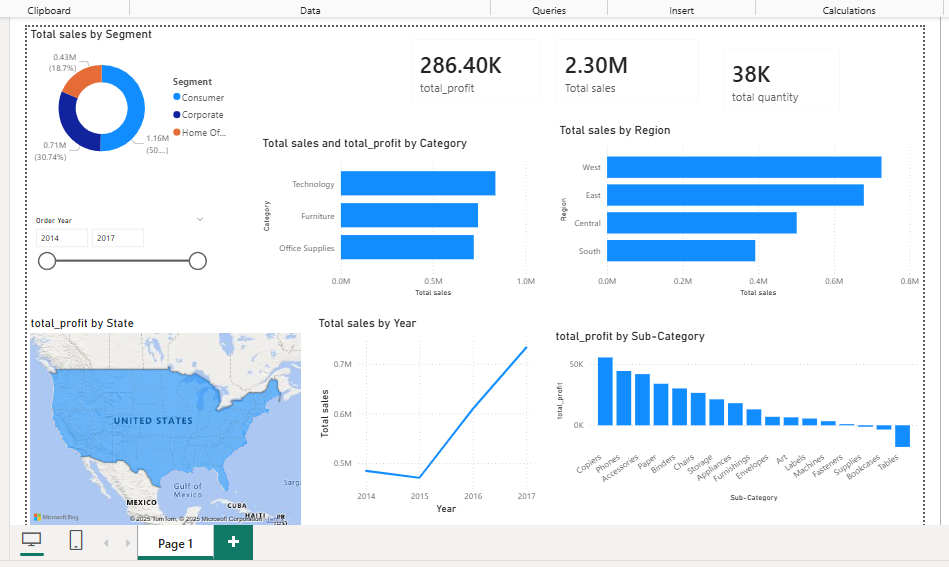
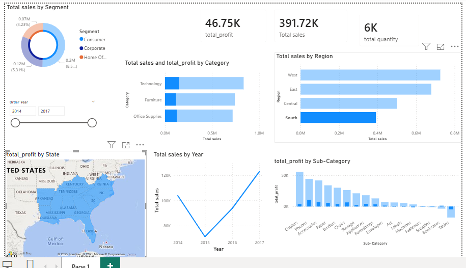

# Superstore Sales Data Analysis & Dashboard

## Project Overview
This project analyzes US Superstore sales data to extract actionable business insights using Python, Excel, and Power BI. The objective was to perform end-to-end data analysis and present findings through an interactive dashboard.

## Tools & Technologies
- Python (Pandas)
- SQL-style Data Aggregations
- Excel Pivot Tables
- Power BI
- DAX

## Dataset
- 9,994 records of US Superstore sales transactions
- Data includes sales, profit, quantity, customer, product, and geographical details

## Key Analysis Performed
- Data cleaning and preprocessing
- Feature engineering (Order Month, Order Year, Month-Year, Profit Margin)
- Category and sub-category performance analysis
- Region and state-wise sales analysis
- Customer segment analysis
- Monthly sales and profit trends
- Identification of loss-making sub-categories

## Power BI Dashboard
The dashboard includes:
- KPI cards for Sales, Profit, Quantity, and Profit Margin
- Monthly sales trend analysis
- Category and sub-category performance
- Region and state-wise sales visualization
- Customer segment distribution

## Business Insights
- West region and California state contribute the highest sales
- Technology category generates maximum revenue
- Certain sub-categories consistently incur losses
- Sales show seasonal trends across months

## Screenshots

